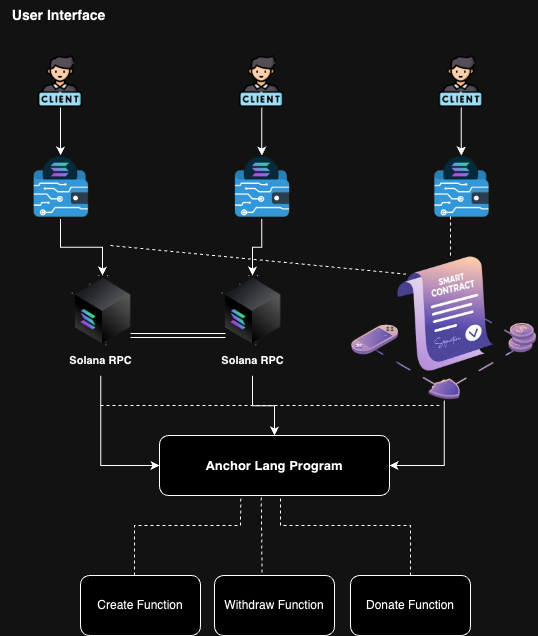

<h1 align="center">
    <br>
    <a href="https://github.com/Samuellyworld/anchor-crowdfund">
        
    </a>
    <br>
</h1>

<h3 align="center">Building a Crowdfunding DApp on Solana with Anchor and Rust</h3>

<p align="center">
    
        
    
    
    
</p>

<p align="center">
    <a href="#-about">About</a> •
    <a href="#-system-design">Architecture</a> •
    <a href="#-features">Features</a> •
    <a href="#-folder-structure">Folder Structure</a> •
    <a href="#-api-documentation">Documentation</a> •
    <a href="#-contributing">Contributing</a> •
    <a href="#-team">Team</a>
</p>

## 📝 About.

Exploring the development of a crowdfunding smart contract on the Solana blockchain, leveraging the Rust programming language and the Anchor framework. Crowdfunding has emerged as a popular method for raising funds for various projects, initiatives, and charitable causes, and blockchain technology introduces new possibilities for enhancing transparency, security, and efficiency in this process.

## 🏛️ Architecture.

<p align="center">
  <br>
      
  <br>
</p>

## 🎯 Features.

The crowdfunding smart contract implemented using the Anchor framework on the Solana blockchain offers a range of features designed to enhance the fundraising experience while ensuring transparency, security, and efficiency.

1. Campaign Creation:

- Project creators can initiate crowdfunding campaigns by providing essential details such as the campaign name, description, target amount, project URL, progress update URL, project image URL, and category.

```javascript
name : "Campaign Name",
description : "Campaign Description",
amount : "Campaign target amount",
project_url : "Campaign website url",
project_update_url : "Campaign if another website but can be default",
project_image_url : "Campaign logo",
category : "which type of campaign"
```

- The smart contract initializes a new campaign account, facilitating the transparent management of funds and project details.

2. Automated Fund Management:

- The smart contract automates fund management processes, including the allocation of donations and the disbursement of funds to project creators.
- Through predefined functions, contributors can seamlessly donate to campaigns, while campaign admins can withdraw funds as needed.

3. Admin Withdrawal Control:

- Withdrawal functionality is restricted to campaign administrators, ensuring that only authorized individuals can access and manage the raised funds.
- Admins can withdraw funds from the campaign account, subject to sufficient balance and compliance with predefined conditions.

4. Secure Fund Handling:

- The smart contract incorporates security measures to safeguard the contributed funds and prevent unauthorized access or misuse.
- Solana's robust consensus mechanism and cryptographic protocols ensure the integrity and security of transactions and data stored on the blockchain.

5. Transparent Fund Tracking:

- Contributions, withdrawals, and campaign updates are recorded transparently on the Solana blockchain, providing stakeholders with real-time visibility into the fundraising process.
- Contributors can track the progress of campaigns, view project updates, and verify the utilization of funds, enhancing trust and accountability.

6. Global Accessibility:

- The crowdfunding platform built on Solana offers global accessibility, allowing contributors from around the world to participate in fundraising campaigns.
- Blockchain technology eliminates geographical barriers and enables frictionless cross-border transactions, promoting inclusivity and broadening the reach of fundraising initiatives.

7. Cost-Effective Transactions:

- Solana's high throughput and low transaction fees make participation in crowdfunding campaigns cost-effective for both contributors and project creators.
- Compared to traditional crowdfunding platforms that may impose significant fees, the blockchain-based solution minimizes transaction costs, maximizing the impact of donations.

8. Immutable Record Keeping:

- Transactional data and campaign details recorded on the Solana blockchain are immutable and tamper-proof, providing a permanent and verifiable record of fundraising activities.
  Immutable records enhance auditability, mitigating the risk of fraud or data manipulation and fostering trust among stakeholders.

## 🗂️ Folder Structure.

```sh
CrowdFund/
├── programs/smart-contracts/
├                   ├── src/
├                        ├── lib.rs  (contains smart contracts code)
├── tests/
     ├── smart-contracts.test.rs (contains small test cases for smart contracts)

```

## 📚 Documentation.

<sup>[(Back to top)](#------------------------)</sup>

This documentation provides an overview of the smart contracts implemented in this project. The smart contracts are designed to facilitate crowdfunding campaigns on the Solana blockchain. Users can create campaigns, donate to existing campaigns, withdraw funds from campaigns, and retrieve campaign information.

Requirements

- Rust
- Solana CLI
- Anchor CLI
- Node.js
- npm

Usage
Creating a Campaign
To create a campaign, users can call the create method with the required parameters:

```rust
pub fn create(
    ctx: Context<Create>,
    name: String,
    description: String,
    target_amount: u64,
    project_url: String,
    progress_update_url: String,
    project_image_url: String,
    category: String
) -> ProgramResult;
```

Donating to a Campaign
To donate to a campaign, users can call the donate method with the required parameters:

```rust
pub fn donate(ctx: Context<Donate>, campaign_id: u64, amount: u64) -> ProgramResult;
```

Withdrawing Funds from a Campaign
To withdraw funds from a campaign, users can call the withdraw method with the required parameters:

```rust
pub fn withdraw(ctx: Context<Withdraw>, campaign_id: u64, amount: u64) -> ProgramResult;
```

Retrieving Campaign Information
To retrieve information about a specific campaign, users can call the get_campaign method with the required parameters:

```rust
pub fn get_campaign(ctx: Context<GetCampaign>, campaign_id: u64) -> ProgramResult;
```

Building, Testing and Deploying the Smart Contract.
[](https://postimg.cc/vcW3Q9SF)

To build the smart contract, run the following command:

```sh
anchor build
```

To test the smart contract, run the following command:

```sh
anchor test
```

To deploy the smart contract, run the following command:

```sh
anchor deploy
```

## 👍 Contributing.

We believe in the power of collaboration and welcome contributions from all members of the community irrespective of your domain knowledge and level of expertise, your input is valuable. Here are a few ways you can get involved:

- Report bugs and issues
- Suggest new features and enhancements
- Contribute to the codebase by submitting pull requests
- Share the project with your network
- Provide feedback and suggestions for improvement

## 👥 Team.

- Samuel Tosin

## 👨🏽‍🍳 Developer Resources.

- [Solana Documentation](https://docs.solana.com/)
- [Anchor Documentation](https://project-serum.github.io/anchor/)
- [Rust Documentation](https://www.rust-lang.org/)

## 📜 License.

This project is licensed under the MIT License - see the [LICENSE](LICENSE) file for details.
